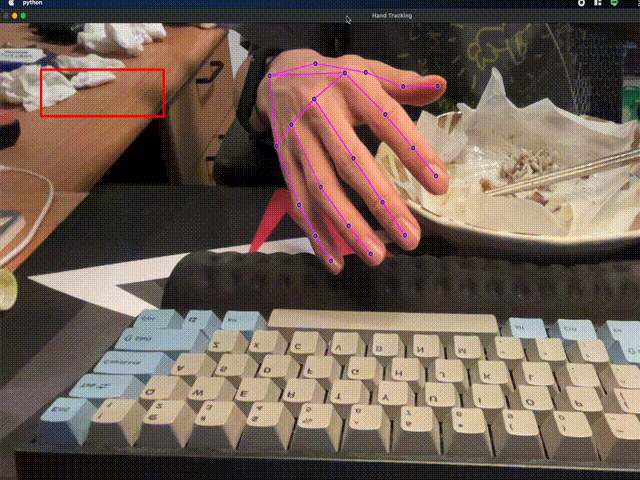

# HCI-Hw4-BackgroundSubtraction

## Demo


## hand detection
使用 mediapipe 的 hand detection 來偵測手部的位置，並且利用手部的位置來判斷是否有接觸到按鈕。

## run
```
python hw5.py
```

## Env

required: 
* python 3.9
* opencv 4.6.0
* mediapipe

tested on:
* macos monterey 12.5 (arm)

